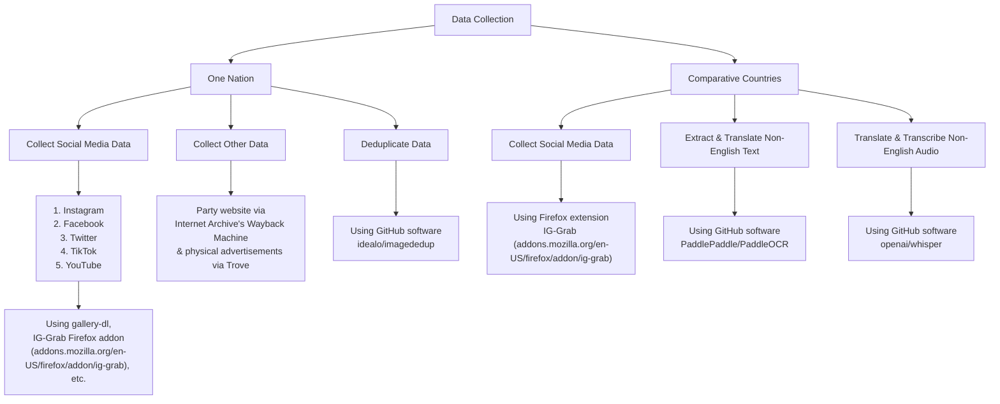

# data-pipeline

HOW TO USE:
good quesiton

Note: Videos are too large to be stored within the repo, hence this is images only

```text
project/
├── src/
│   ├── main.py
│   ├── utils.py
│   └── config.py
├── docs/
│   └── README.md
└── tests/
```
Data processing flow chart:

