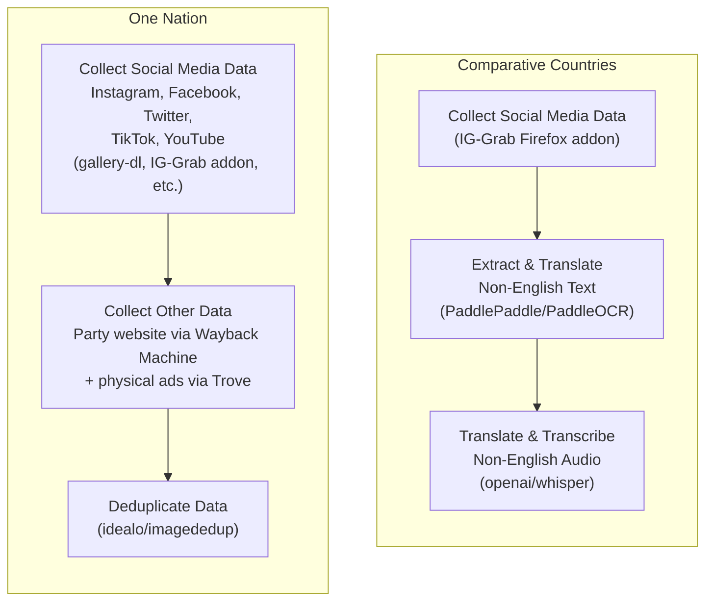

# data-pipeline

HOW TO USE:
good quesiton

Note: Videos are too large to be stored within the repo, hence this is images only

```mermaid
flowchart TD
    subgraph CC["Comparative Countries"]
        direction TB
        B1["Collect Social Media Data
(IG-Grab Firefox addon)"]
        B2["Extract & Translate
Non-English Text
(PaddlePaddle/PaddleOCR)"]
        B3["Translate & Transcribe
Non-English Audio
(openai/whisper)"]
        B1 --> B2 --> B3
    end

    subgraph ON["One Nation"]
        direction TB
        A1["Collect Social Media Data
Instagram, Facebook, Twitter,
TikTok, YouTube
(gallery-dl, IG-Grab addon, etc.)"]
        A2["Collect Other Data
Party website via Wayback Machine
+ physical ads via Trove"]
        A3["Deduplicate Data
(idealo/imagededup)"]
        A1 --> A2 --> A3
    end
```
